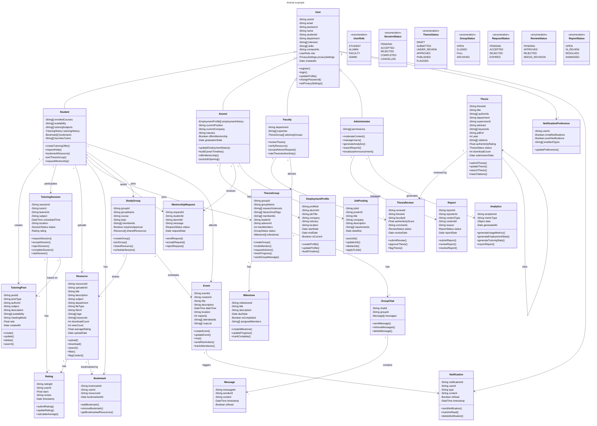

```mermaid
---
title: Animal example
---
classDiagram
    %% Core User Classes
    class User {
        -String userId
        -String email
        -String password
        -String name
        -String studentId
        -String department
        -String[] interests
        -String[] skills
        -String contactInfo
        -UserRole role
        -PrivacySettings privacySettings
        -Date createdAt
        +register()
        +login()
        +updateProfile()
        +changePassword()
        +setPrivacySettings()
    }

    class Student {
        -String[] enrolledCourses
        -String[] availability
        -String[] tutoringSubjects
        -TutoringHistory tutoringHistory
        -Bookmark[] bookmarks
        -String[] favoritesTutors
        +createTutoringOffer()
        +requestHelp()
        +bookmarkResource()
        +joinThesisGroup()
        +requestMentorship()
    }

    class Alumni {
        -EmploymentProfile[] employmentHistory
        -String currentPosition
        -String currentCompany
        -String industry
        -Boolean offersMentorship
        -Date graduationDate
        +updateEmploymentStatus()
        +buildCareerTimeline()
        +offerMentorship()
        +postJobOpening()
    }

    class Faculty {
        -String department
        -String[] expertise
        -ThesisGroup[] advisingGroups
        +reviewThesis()
        +verifyResource()
        +acceptAdvisorRequest()
        +rateThesisAuthenticity()
    }

    class Administrator {
        -String[] permissions
        +moderateContent()
        +manageUsers()
        +generateAnalytics()
        +exportReports()
        +broadcastAnnouncement()
    }

    %% Tutoring Module Classes
    class TutoringPost {
        -String postId
        -String postType
        -String authorId
        -String subject
        -String description
        -String[] availability
        -String meetingMode
        -Float rate
        -Date createdAt
        +create()
        +update()
        +delete()
        +search()
    }

    class TutoringSession {
        -String sessionId
        -String tutorId
        -String learnerId
        -String subject
        -DateTime scheduledTime
        -String location
        -SessionStatus status
        -Rating rating
        +requestSession()
        +acceptSession()
        +rejectSession()
        +completeSession()
        +rateSession()
    }

    class Rating {
        -String ratingId
        -String userId
        -Float stars
        -String review
        -Date timestamp
        +submitRating()
        +updateRating()
        +calculateAverage()
    }

    %% Resource Sharing Classes
    class Resource {
        -String resourceId
        -String uploaderId
        -String title
        -String description
        -String subject
        -String department
        -String fileType
        -String fileUrl
        -String[] tags
        -String[] keywords
        -Int downloadCount
        -Int viewCount
        -Float averageRating
        -Date uploadDate
        +upload()
        +download()
        +search()
        +filter()
        +flagContent()
    }

    class Bookmark {
        -String bookmarkId
        -String userId
        -String resourceId
        -Date bookmarkedAt
        +addBookmark()
        +removeBookmark()
        +getBookmarkedResources()
    }

    %% Thesis Collaboration Classes
    class ThesisGroup {
        -String groupId
        -String groupName
        -String[] researchInterests
        -String[] hierarchicalTags
        -String[] memberIds
        -String leaderId
        -String advisorId
        -Int maxMembers
        -GroupStatus status
        -Milestone[] milestones
        +createGroup()
        +inviteMember()
        +requestAdvisor()
        +trackProgress()
        +sendGroupMessage()
    }

    class Milestone {
        -String milestoneId
        -String title
        -String description
        -Date dueDate
        -Boolean isCompleted
        -String[] assignedMembers
        +createMilestone()
        +updateProgress()
        +markComplete()
    }

    class GroupChat {
        -String chatId
        -String groupId
        -Message[] messages
        +sendMessage()
        +retrieveMessages()
        +deleteMessage()
    }

    class Message {
        -String messageId
        -String senderId
        -String content
        -DateTime timestamp
        -Boolean isRead
    }

    %% Thesis Repository Classes
    class Thesis {
        -String thesisId
        -String title
        -String[] authorIds
        -String department
        -String supervisorId
        -String abstract
        -String[] keywords
        -String pdfUrl
        -Int year
        -String[] citations
        -Float authenticityRating
        -ThesisStatus status
        -Int downloadCount
        -Date submissionDate
        +submitThesis()
        +updateThesis()
        +searchThesis()
        +trackCitations()
    }

    class ThesisReview {
        -String reviewId
        -String thesisId
        -String facultyId
        -Float authenticityScore
        -String comments
        -ReviewStatus status
        -Date reviewDate
        +submitReview()
        +approveThesis()
        +flagThesis()
    }

    %% Alumni Career Tracking Classes
    class EmploymentProfile {
        -String profileId
        -String alumniId
        -String jobTitle
        -String company
        -String industry
        -String location
        -Date startDate
        -Date endDate
        -Boolean isCurrent
        +createProfile()
        +updateProfile()
        +buildTimeline()
    }

    class MentorshipRequest {
        -String requestId
        -String studentId
        -String alumniId
        -String message
        -RequestStatus status
        -Date requestDate
        +sendRequest()
        +acceptRequest()
        +rejectRequest()
    }

    class JobPosting {
        -String jobId
        -String posterId
        -String title
        -String company
        -String description
        -String[] requirements
        -Date deadline
        +postJob()
        +updateJob()
        +deleteJob()
        +applyToJob()
    }

    %% Study Groups & Events Classes
    class StudyGroup {
        -String groupId
        -String groupName
        -String course
        -String topic
        -String[] memberIds
        -Boolean requiresApproval
        -Resource[] sharedResources
        +createGroup()
        +joinGroup()
        +shareResource()
        +scheduleSession()
    }

    class Event {
        -String eventId
        -String creatorId
        -String title
        -String description
        -DateTime dateTime
        -String location
        -Int capacity
        -String[] attendeeIds
        -String[] rsvpList
        +createEvent()
        +updateEvent()
        +rsvp()
        +sendReminders()
        +trackAttendance()
    }

    %% Notification & Communication Classes
    class Notification {
        -String notificationId
        -String userId
        -String type
        -String content
        -Boolean isRead
        -DateTime timestamp
        +sendNotification()
        +markAsRead()
        +deleteNotification()
    }

    class NotificationPreference {
        -String userId
        -Boolean emailNotifications
        -Boolean pushNotifications
        -String[] enabledTypes
        +updatePreferences()
    }

    %% Analytics & Administration Classes
    class Analytics {
        -String analyticsId
        -String metricType
        -Object data
        -Date generatedAt
        +generateUsageMetrics()
        +generateEmploymentStats()
        +generateTutoringStats()
        +exportReport()
    }

    class Report {
        -String reportId
        -String reporterId
        -String contentType
        -String contentId
        -String reason
        -ReportStatus status
        -Date reportDate
        +submitReport()
        +reviewReport()
        +resolveReport()
    }

    %% Enumerations
    class UserRole {
        <<enumeration>>
        STUDENT
        ALUMNI
        FACULTY
        ADMIN
    }

    class SessionStatus {
        <<enumeration>>
        PENDING
        ACCEPTED
        REJECTED
        COMPLETED
        CANCELLED
    }

    class ThesisStatus {
        <<enumeration>>
        DRAFT
        SUBMITTED
        UNDER_REVIEW
        APPROVED
        PUBLISHED
        FLAGGED
    }

    class GroupStatus {
        <<enumeration>>
        OPEN
        CLOSED
        FULL
        ARCHIVED
    }

    class RequestStatus {
        <<enumeration>>
        PENDING
        ACCEPTED
        REJECTED
        EXPIRED
    }

    class ReviewStatus {
        <<enumeration>>
        PENDING
        APPROVED
        REJECTED
        NEEDS_REVISION
    }

    class ReportStatus {
        <<enumeration>>
        OPEN
        IN_REVIEW
        RESOLVED
        DISMISSED
    }

    %% Relationships
    User <|-- Student
    User <|-- Alumni
    User <|-- Faculty
    User <|-- Administrator
    User "1" --> "1" NotificationPreference
    User "1" --> "*" Notification

    Student "1" --> "*" TutoringPost : creates
    Student "1" --> "*" TutoringSession : participates
    Student "1" --> "*" Resource : uploads
    Student "1" --> "*" Bookmark : has
    Student "1" --> "*" ThesisGroup : joins
    Student "1" --> "*" MentorshipRequest : sends
    Student "1" --> "*" StudyGroup : joins
    Student "1" --> "*" Event : attends

    Alumni "1" --> "*" EmploymentProfile : has
    Alumni "1" --> "*" MentorshipRequest : receives
    Alumni "1" --> "*" JobPosting : posts

    Faculty "1" --> "*" ThesisReview : submits
    Faculty "1" --> "*" ThesisGroup : advises

    Administrator "1" --> "*" Report : manages
    Administrator "1" --> "*" Analytics : generates

    TutoringSession "1" --> "1" Rating : has
    TutoringSession "1" --> "1" TutoringPost : based on

    Resource "1" --> "*" Rating : has
    Resource "1" --> "*" Bookmark : bookmarked by

    ThesisGroup "1" --> "*" Milestone : has
    ThesisGroup "1" --> "1" GroupChat : has
    GroupChat "1" --> "*" Message : contains

    Thesis "1" --> "*" ThesisReview : reviewed by
    Thesis "*" --> "*" Thesis : cites

    StudyGroup "1" --> "*" Resource : shares
    StudyGroup "1" --> "*" Event : schedules

    Event "1" --> "*" Notification : triggers
    
```
